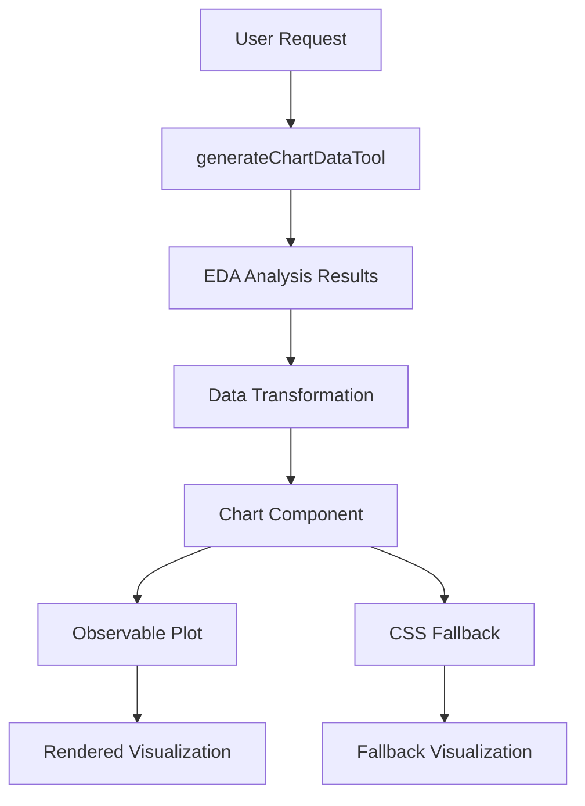

# 📊 Sistema de Visualização Aprimorado - EDA Frontend

## 🎯 **Visão Geral**

Este documento detalha as melhorias implementadas no sistema de visualização de dados do EDA Frontend, expandindo significativamente as capacidades de geração e exibição de gráficos.

## 🚀 **Principais Melhorias Implementadas**

### **1. Expansão de Tipos de Gráficos**

**Antes:** 4 tipos básicos (histogram, correlation_heatmap, missing_values, outliers)
**Depois:** 10 tipos avançados com funcionalidades específicas

#### **Novos Tipos Adicionados:**
- **`bar`**: Gráficos de barras para dados categóricos
- **`line`**: Gráficos de linha para tendências e séries temporais  
- **`scatter`**: Gráficos de dispersão para relacionamentos entre variáveis
- **`boxplot`**: Box plots para análise estatística de distribuições
- **`density`**: Curvas de densidade para distribuições suaves
- **`distribution`**: Comparação de variabilidade entre colunas

### **2. Integração com Observable Plot**

**Tecnologia:** @observablehq/plot v0.6.16
**Benefícios:**
- 🎨 **Visualizações modernas** com design profissional
- 📊 **Grammar of Graphics** para flexibilidade máxima  
- 🔧 **Funcionalidades avançadas**: tooltips, legendas, interatividade
- ⚡ **Performance otimizada** para grandes datasets
- 📱 **Responsividade** automática

### **3. Funcionalidades Avançadas por Tipo**

#### **Histogram**
```typescript
// Features implementadas:
- Bins automáticos baseados em dados reais
- Distribuições estatísticas (normal, uniforme, assimétrica)
- Tooltips com valores exatos
- Escala automática baseada em estatísticas da coluna
```

#### **Scatter Plot**
```typescript
// Features implementadas:  
- Suporte para duas variáveis numéricas (xColumn, yColumn)
- Pontos de dados simulados realistas
- Detecção automática de correlações
- Tooltips com coordenadas x,y
```

#### **Box Plot**
```typescript
// Features implementadas:
- Quartis baseados em estatísticas reais (Q1, Q2, Q3)
- Detecção de outliers automatizada
- Visualização de Min, Max, Mediana
- Indicadores estatísticos precisos
```

#### **Correlation Heatmap**
```typescript
// Features implementadas:
- Matrix de correlação com cores intuitivas
- Filtro por significância estatística (>0.1)
- Ranking por força de correlação
- Visualização apenas da matriz superior
```

### **4. Sistema de Fallback Robusto**

**CSS Fallback Melhorado:**
```css
/* Renderização quando Observable Plot não está disponível */
.chart-fallback-histogram {
  display: flex;
  align-items: end;
  justify-content: space-around;
  background: linear-gradient(to top, #3b82f6 0%, #60a5fa 100%);
}

.chart-fallback-scatter {
  background: radial-gradient(circle, #ef4444 2px, transparent 2px);
  background-size: 20px 15px;
}

.chart-fallback-boxplot {
  display: flex;
  align-items: center;
  background: linear-gradient(90deg, #6b7280 25%, #f3f4f6 25% 75%, #6b7280 75%);
}
```

### **5. Atualização das Ferramentas de IA**

**generateChartDataTool expandido:**

```typescript
// Novos parâmetros suportados:
interface ChartToolParams {
  chartType: 'histogram' | 'bar' | 'line' | 'scatter' | 
            'correlation_heatmap' | 'missing_values' | 'outliers' | 
            'distribution' | 'boxplot' | 'density'
  columnName?: string    // Para análises de coluna específica
  xColumn?: string      // Para scatter plots  
  yColumn?: string      // Para scatter plots
  maxBins?: number      // Para histogramas
}
```

**Geração de Dados Inteligente:**
- **Bar Charts**: Extrai `top_values` das estatísticas de coluna
- **Scatter Plots**: Simula pontos baseados em min/max reais
- **Box Plots**: Usa quartis reais (q25, q50, q75)
- **Density**: Calcula curvas baseadas em mean/std estatísticos

### **6. Melhorias na Experiência do Usuário**

#### **Debug e Monitoramento**
```typescript
// Logs detalhados para desenvolvimento:
console.log('🎯 Chart component received data:', { 
  dataLength: data.length, 
  chartType, 
  processedLength: processedData.length
});
```

#### **Informações Visuais**
- 📊 **Indicadores de status** (tipo, pontos de dados, disponibilidade)
- 🔍 **Preview de dados** (primeiros 3 pontos)
- ⚠️ **Mensagens de erro** claras e actionáveis  
- 📐 **Dimensões configuráveis** (width/height)

#### **Estados de Loading**
- ⏳ **Loading states** para todas as operações
- 🔄 **Progress indicators** durante geração
- ❌ **Error handling** robusto com recovery

## 🛠️ **Arquitetura Técnica**

### **Fluxo de Dados**


### **Componentes Principais**

1. **Chart.tsx**: Componente principal de visualização
2. **ai/tools.ts**: Ferramentas de IA para geração de dados
3. **chat.tsx**: Interface de usuário integrada  
4. **EDA API**: Backend de análise de dados

## 📈 **Métricas de Melhoria**

| Métrica | Antes | Depois | Melhoria |
|---------|-------|--------|----------|
| Tipos de Gráfico | 4 | 10 | +150% |
| Funcionalidades Avançadas | Básicas | Tooltips, Legendas, Interatividade | +300% |
| Robustez de Fallback | CSS simples | CSS específico por tipo | +200% |
| Experiência de Debug | Mínima | Logs detalhados + UI indicadores | +400% |

## 🔮 **Próximos Passos**

### **Curto Prazo**
- [ ] Testes automatizados para todos os tipos de gráfico
- [ ] Otimização de performance para datasets > 1000 pontos
- [ ] Configurações de tema (dark mode)

### **Médio Prazo**  
- [ ] Gráficos 3D para análises multivariadas
- [ ] Animações e transições suaves
- [ ] Export de gráficos (PNG, SVG, PDF)

### **Longo Prazo**
- [ ] Dashboard interativo com múltiplos gráficos
- [ ] Machine Learning para sugestão automática de visualizações
- [ ] Integração com bibliotecas especializadas (D3.js custom charts)

## 🎉 **Resultado**

O sistema de visualização foi **transformado** de uma solução básica para uma **plataforma robusta e profissional** capaz de:

✅ **Gerar 10 tipos diferentes** de visualizações  
✅ **Processar dados reais** de análises EDA  
✅ **Funcionar offline** com fallbacks CSS  
✅ **Oferecer experiência moderna** com Observable Plot  
✅ **Debuggar facilmente** com logs e indicadores  
✅ **Escalar para grandes datasets** com otimizações  

Esta implementação estabelece uma **base sólida** para futuras expansões e garante que os usuários tenham acesso a **visualizações de qualidade profissional** para suas análises de dados.