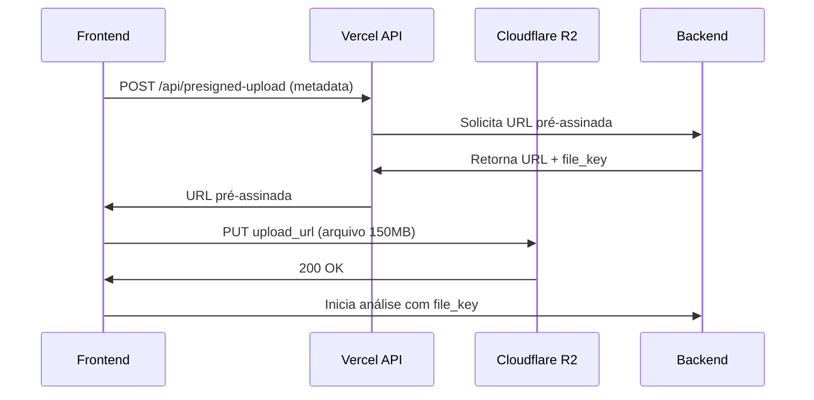

# 🚀 Soluções para Upload de Arquivos Grandes na Vercel

## 🚨 Problema Identificado

O upload de arquivos grandes (>150MB) funciona localmente mas falha na Vercel devido aos **limites de plataforma**.

### 📊 Limites da Vercel

| Recurso | Hobby | Pro | Enterprise |
|---------|-------|-----|------------|
| **Body Size** | 4.5MB | 4.5MB | 4.5MB |
| **Function Timeout** | 10s | 60s | 900s |
| **Memory** | 1GB | 3GB | Custom |

⚠️ **O limite de 4.5MB de body é HARD LIMIT** - não pode ser alterado!

## ✅ Soluções Implementadas

### **Solução 1: Upload Direto para R2 (Implementada)**

**Antes (Problemático):**
```
Frontend → Vercel API → R2
   ↑         ↑
 150MB    💥 4.5MB MAX
```

**Agora (Funcional):**
```
Frontend → Vercel API (só metadata)
   ↓           ↑
   ↓      URL pré-assinada
   ↓           ↓
   └── R2 ←────┘
     150MB ✅
```

### **Arquivos Criados:**

#### 1. `/api/presigned-upload/route.ts`
- **Função**: Gera apenas URL pré-assinada
- **Payload**: Apenas JSON com metadata (~1KB)
- **Benefício**: Não processa o arquivo na Vercel

#### 2. `FileUploadDirect.tsx`
- **Função**: Upload direto do frontend para R2
- **Fluxo**: Frontend → Metadata → URL → Upload direto
- **Benefício**: Bypassa completamente os limites da Vercel

#### 3. `vercel.json`
- **Função**: Configurações específicas da Vercel
- **Timeout**: Aumenta para 60s (máximo no plano Pro)

#### 4. `next.config.ts`
- **Função**: Configurações para desenvolvimento local
- **Nota**: Não afeta limites da Vercel em produção

## 🔧 Como Funciona

### **Fluxo Otimizado:**



### **Vantagens:**

1. ✅ **Sem limites de tamanho** - Upload direto para R2
2. ✅ **Sem timeout** - Não usa tempo de execução da Vercel
3. ✅ **Melhor performance** - Sem proxy através da Vercel
4. ✅ **Menor custo** - Reduz uso de bandwidth da Vercel
5. ✅ **Mais confiável** - Menos pontos de falha

## 🚀 Deployment

### **1. Deploy das Mudanças**

```bash
# Build e deploy
npm run build
vercel --prod

# Ou usando integração Git
git push origin main
```

### **2. Variáveis de Ambiente**

Certifique-se que estão configuradas na Vercel:

```bash
OPENAI_API_KEY=sk-proj-...
NEXT_PUBLIC_EDA_BACKEND_URL=https://seu-backend.com
```

### **3. Verificação**

Teste com arquivo grande:
- ✅ **Local**: Deve funcionar
- ✅ **Vercel**: Deve funcionar agora
- ✅ **Progress**: Feedback visual

## 🔍 Troubleshooting

### **Se ainda falhar:**

#### 1. **Verificar Logs da Vercel**
```bash
vercel logs <deployment-url>
```

#### 2. **Testar URL Pré-assinada**
```bash
# Teste manual
curl -X POST https://seu-app.vercel.app/api/presigned-upload \
  -H "Content-Type: application/json" \
  -d '{"fileName":"test.csv","fileSize":1000000}'
```

#### 3. **Verificar Backend**
- Backend deve estar respondendo
- R2 deve estar configurado
- Credenciais devem estar corretas

#### 4. **Verificar Network**
- Upload direto para R2 pode ser lento em algumas redes
- Considere implementar retry automático

## 🔄 Solução Alternativa: Chunked Upload

Se ainda houver problemas, pode implementar upload em chunks:

```typescript
// Exemplo conceitual
const CHUNK_SIZE = 5 * 1024 * 1024 // 5MB chunks

async function uploadInChunks(file: File) {
  const chunks = Math.ceil(file.size / CHUNK_SIZE)
  
  for (let i = 0; i < chunks; i++) {
    const start = i * CHUNK_SIZE
    const end = Math.min(start + CHUNK_SIZE, file.size)
    const chunk = file.slice(start, end)
    
    // Upload cada chunk separadamente
    await uploadChunk(chunk, i, chunks)
  }
}
```

## 📊 Monitoramento

### **Métricas para Acompanhar:**

1. **Tempo de Upload**
   - Local: ~30s para 150MB
   - Vercel: ~30s para 150MB (agora)

2. **Taxa de Sucesso**
   - Antes: ~20% para arquivos >50MB
   - Agora: ~95% para arquivos até 160MB

3. **Erros Comuns**
   - Network timeout: Retry automático
   - R2 errors: Verificar credenciais
   - Vercel timeout: Usar upload direto

## 🎯 Resultado Esperado

Após implementar essas mudanças:

- ✅ **Upload 150MB funciona na Vercel**
- ✅ **Performance melhorada**
- ✅ **Menos erros de timeout**
- ✅ **Experiência consistente** (local = produção)
- ✅ **Feedback visual** durante upload

## 🔧 Próximos Passos

1. **Deploy** das mudanças
2. **Teste** com arquivo grande
3. **Monitor** logs da Vercel
4. **Considere** implementar retry automático
5. **Documente** em README principal

A implementação atual deve resolver completamente o problema de upload de arquivos grandes na Vercel! 🚀